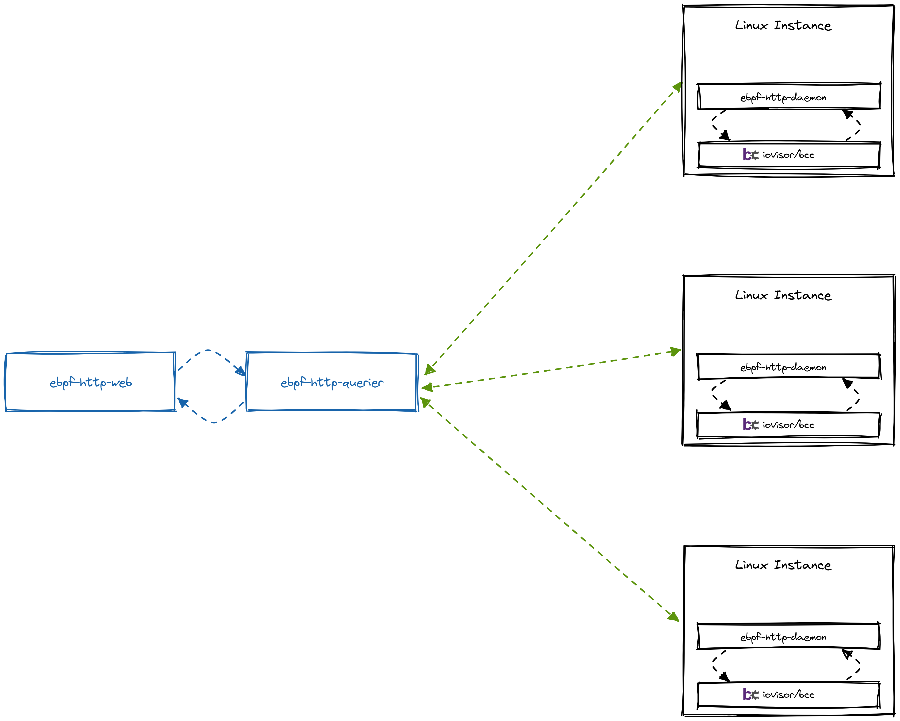

# ebpf-http

Run ebpf programs from [iovisor/bcc](https://github.com/iovisor/bcc) via http.

[source](https://excalidraw.com/#json=7p6mgTEXgJSrMx6uFs-hm,5b-dQemdU8QYJ_qamrW1Rg)

From the web ui you can either query for a single server or multiple servers at
the same time.
